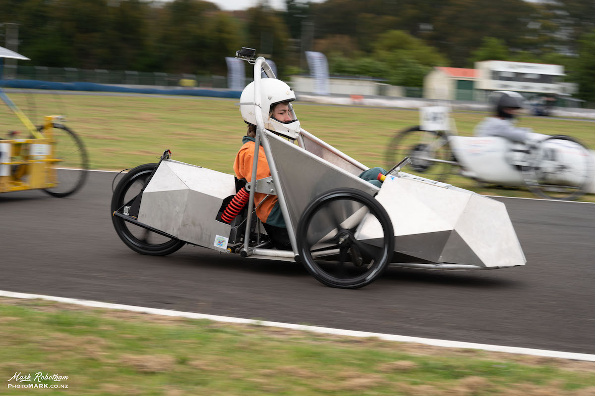

# Fantail Go

Throughout 2019, we, a group of students, worked to build an electric go-kart from the ground up. Across the entire vehicle _everything_ was controlled digitally via a pair of Raspberry Pi’s — giving us detailed control over performance, and _lots_ of diagnostics data.

**This repository is not a prepared do-it-yourself project.** Instead, we hope that it might provide some appreciated insight into someone else’s approaches to common problems, for your own work.

The structural and mechanical designs will remain private.

## Repository Structure
#### [vehicle](https://github.com/Crummjyz/fantail-go/tree/main/vehicle)
The code running on each of the onboard Raspberry Pi’s, providing control of the vehicle and data transmission/processing.
_Note — the programs in the ‘tests’ folders are not software tests, but small, isolated scripts to allow manual operation of some hardware components. _

#### [dash](https://github.com/Crummjyz/fantail-go/tree/main/dash)
A Flutter app to display realtime data to the driver.

#### [board](https://github.com/Crummjyz/fantail-go/tree/main/board)
The EAGLE files for our custom PCB/breakout-board.

---- 
_This repository was originally at [https://github.com/Fantail-Dev/fantail-go](https://github.com/Fantail-Dev/fantail-go). It has been migrated here for easier oversight._
